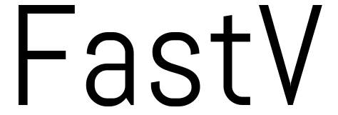

<p align="center"></p>

-------------

[](https://travis-ci.org/juliandavidmr/fastv)


Get the version of a program quickly.

## Installation
Install via npm:
```bash
npm install --save fastv
```
Install via git:
```bash
git clone https://github.com/juliandavidmr/fastv
```

## Examples
```js
var fastv = require("fastv");

fastv("vlc", function (err, version) {
    if(err) throw err;
    console.log(version);
    //=> 2.2.2
})
```

```js
fastv("sublimetext", function (err, version) {
    if(err) throw err;
    console.log(version);
    //=> 3126
})
```

```js
fastv("nodejs", function (err, version) {
    if(err) throw err;
    console.log(version);
    //=> 7.7.2
})
```

```js
fastv("kernel", function (err, version) { // Only linux
    if(err) throw err;
    console.log(version);
    //=> 4.4.0-64
})
```

## Programs available
* Atom
* Audacity
* Cheese
* Emacs
* Firefox
* Gedit
* GoogleChrome
* Gnomecalculator
* Gimp
* Git
* Kazam
* LibreOffice
* Nemo
* NodeJS
* NPM
* [NCU](https://www.npmjs.com/package/npm-check-updates)
* Shotwell
* Openshot
* OS
* Plank
* Python
* Java
* Javac
* Kernel                
* Systemd
* Transmission
* Unity
* Virtualbox
* VisualCode
* Vlc
* Zenmap
* Zip
* [Zsh](https://github.com/robbyrussell/oh-my-zsh)
* And more...

## Contributors

* [Julian David](https://github.com/juliandavidmr)
* [Mitch Aguilar](https://github.com/MitchAguilar)


### _I accept any pull request_

## License
MIT